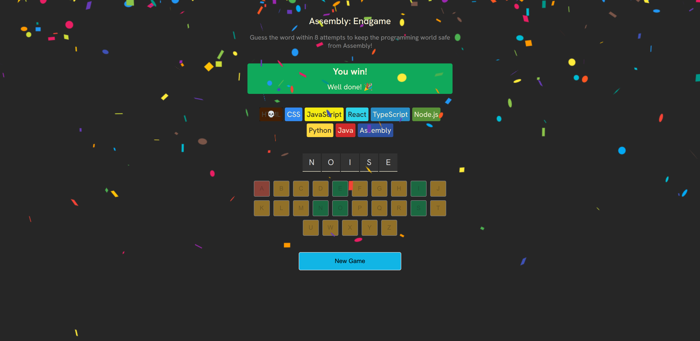
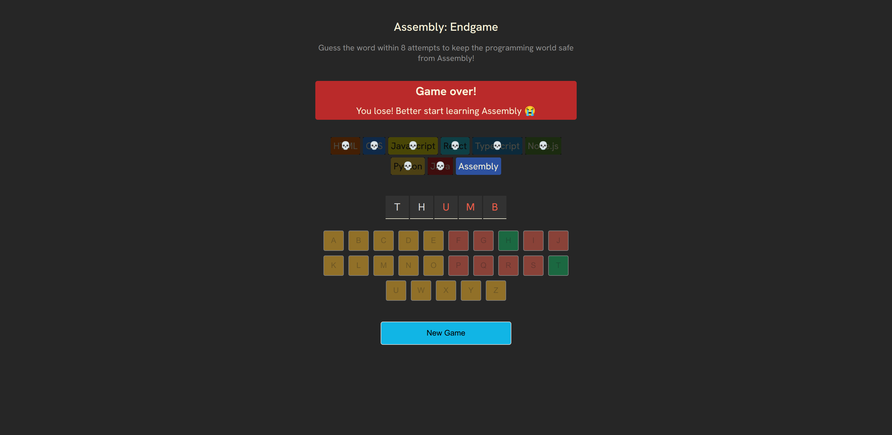

# Assembly: Endgame 🎮

A word guessing game built with **React** as part of the **Learn React** course by **Scrimba**.

The objective is simple: guess the hidden word one letter at a time before you run out of attempts. The project focuses on applying modern React concepts by building a complete interactive application from scratch.

## 🚀 Demo
https://assembly-endgame-vigneshblue.vercel.app/

## 📸 Screenshot

### Win State



### Lose State



---

## ✨ Features

- Interactive word guessing game
- Random word selection
- Tracks correct and incorrect guesses
- Visual keyboard with disabled guessed letters
- Win and lose game states
- New Game functionality
- Responsive UI
- Accessibility improvements

---

## 🛠️ Built With

- React
- Vite
- JavaScript (ES6+)
- HTML5
- CSS3

---

## 📚 What I Learned

This project helped me gain hands-on experience with:

- Functional React components
- JSX
- Props
- State management using `useState`
- Conditional rendering
- Event handling
- Working with arrays and objects
- Rendering lists with `map()`
- Derived state
- Accessibility (a11y) improvements
- Component-based architecture

---

## 📦 Installation

Clone the repository

```bash
git clone https://github.com/vigneshblue/scrimba-react-assembly-end-game.git
```

Navigate to the project

```bash
cd scrimba-react-assembly-end-game
```

Install dependencies

```bash
npm install
```

Start the development server

```bash
npm run dev
```

Open your browser at

```
http://localhost:5173
```

---

## 📂 Project Structure

```
src/
├── components/
├── assets/
├── App.jsx
├── main.jsx
└── ...
```

---

## 🎓 Course

This project was created while following the **Learn React** course by Scrimba.

Course:
https://scrimba.com/learn-react-c0e

The course contains 170+ interactive coding challenges and multiple projects, with **Assembly: Endgame** serving as the final capstone project that combines React concepts into a complete application. :contentReference[oaicite:0]{index=0}

---

## 🙏 Acknowledgements

Special thanks to **Bob Ziroll** and **Scrimba** for creating an excellent interactive React course that emphasizes learning by building real projects. :contentReference[oaicite:1]{index=1}

---

## 📄 License

This project is intended for learning purposes.